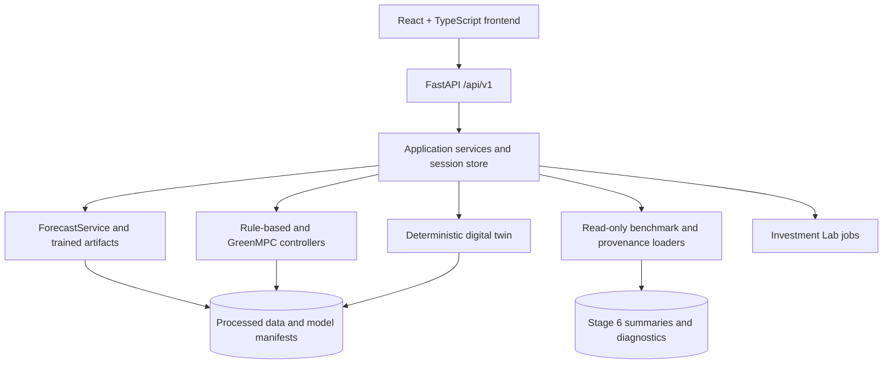

# GreenMPC Twin

### AI Energy Digital Twin for Intelligent Industrial Parks

GreenMPC Twin transforms uncertain energy forecasts into safe, explainable, and operational dispatch decisions for industrial parks.

| Link | Destination |
|---|---|
| Live Application | https://greenmpc-twin.fly.dev |
| Source Code | https://github.com/anthe8105/GreenMPC_VAIC |
| Primary Interface | React + FastAPI command center deployed with Docker on Fly.io |
| Local Runtime | Fully runnable locally after dependency and frontend build setup |

The deployed application is not a static mockup. Forecasts, optimization decisions, action validation, simulator transitions, energy-flow updates, and KPI updates are generated by the Python backend using the repository's processed data, trained forecasting artifacts, digital twin, and controllers.

The current prototype uses public, derived, and transparent scenario data. It does not claim access to confidential VRG operational data.

## Key Verified Numbers

| Verified item | Value | Evidence |
|---|---:|---|
| Forecasting tasks | 2 | `models/forecasting/model_manifest.json` |
| Forecast horizons | 6 | `configs/forecasting.yaml` |
| Forecast quantiles | P10 / P50 / P90 | `configs/forecasting.yaml` |
| Trained forecasting artifacts | 36 | `models/forecasting/model_manifest.json` |
| Representative tenants | 5 | `configs/demo.yaml` |
| Operational scenarios | 4 | `configs/evaluation.yaml` |
| Controller configurations | 3 | `configs/evaluation.yaml` |
| Completed scenario-controller runs | 12 | `data/outputs/stage6_benchmark/benchmark_manifest.json` |
| Hours per stored benchmark run | 72 | `data/outputs/stage6_benchmark/benchmark_manifest.json` |
| Executed benchmark control steps | 864 | `data/outputs/stage6_benchmark/controller_scenario_metrics.csv` |
| Invalid benchmark actions | 0 | `data/outputs/stage6_benchmark/controller_scenario_metrics.csv` |
| Hard-constraint violations | 0 | `data/outputs/stage6_benchmark/controller_scenario_metrics.csv` |
| Normal Operations peak-grid reduction | 18.87% | Expected GreenMPC versus rule-based baseline in `data/outputs/stage6_benchmark/controller_scenario_metrics.csv` |

These are prototype benchmark results on public, derived, and scenario data. They are not guaranteed real-site savings. The 18.87% peak-grid reduction compares Expected GreenMPC with the Conventional Rule-Based Baseline in the stored Normal Operations scenario.

## Problem

Industrial parks must coordinate electricity demand, rooftop solar, battery energy storage system (BESS), direct power purchase agreement (DPPA) renewable supply, grid import, transformer limits, and tenant renewable targets.

In practice, these decisions are hard because tenant demand and solar generation are uncertain, energy sources are often managed separately, fixed rules cannot adapt to changing conditions, and tenants need transparent renewable-source attribution. Infrastructure planners also need a way to compare PV, BESS, and DPPA options before making capital decisions.

## Solution

GreenMPC Twin combines:

- probabilistic AI forecasting for tenant load and park solar availability;
- receding-horizon model predictive control (MPC);
- a deterministic digital twin with strict action validation;
- tenant-level renewable allocation accounting;
- closed-loop controller benchmarking under normal and stress scenarios;
- a React/FastAPI command center for live operation and review;
- an Investment Lab for baseline-versus-proposal scenario analysis.

The product answers four operating questions: what is happening now, what is likely to happen next, what action GreenMPC recommends, and what operational value the decision creates.

## 90-Second Judge Workflow

1. Open https://greenmpc-twin.fly.dev.
2. Use the default Live Demo page and the default `Cost & Peak Optimizer` controller.
3. Click `Start Live Demo` or `Run 3-Hour Guided Demo`.
4. Watch the visible cycle progress through observe, forecast, optimize, validate, and execute phases.
5. Inspect the six-hour P10/P50/P90 load and solar forecast.
6. Review the next-hour dispatch across solar, DPPA, battery, and grid supply.
7. Observe the simulated timestamp, battery state of charge, energy topology, operating cost, and rolling history update after execution.
8. Trigger `Solar Drop` or `Combined Stress` and observe reforecasting and replanning.

Advanced users can switch to `Operator Approval`, `Live Autonomous Demo`, or `Recommendation Only` modes from the UI.

## How It Works

GreenMPC Twin uses receding-horizon control:

1. Observe the current digital-twin state.
2. Forecast the next six hours.
3. Optimize a six-hour dispatch plan.
4. Validate the first action.
5. Execute exactly one simulated hour.
6. Measure the new state and replan.


The optimizer plans six hours ahead but only the first hour is executed. The next hour starts from a newly observed simulator state.

## Why the Architecture Is AI-Native

AI is not used only for visualization. The forecasting layer directly shapes the control decision.

The chain is:

```text
observed state
-> probabilistic load and solar forecasts
-> controller-specific quantile selection
-> constrained optimization
-> validated action
-> digital-twin execution
-> updated state
-> replanning
```

The forecasting registry contains 36 trained artifacts:

```text
2 forecasting tasks x 6 horizons x 3 quantiles = 36 models
```

The two tasks are tenant load and park solar availability. P10, P50, and P90 are forecast quantiles, not a 95% confidence interval. The system does not claim online self-training, continual model-weight updates, or reinforcement learning.

## GreenMPC Operating Modes

| User-facing controller | Technical ID | Forecast input | Intended use |
|---|---|---|---|
| Conventional Rule-Based Baseline | `rule_based` | Current observed state only | Transparent benchmark policy without learned forecasts or optimization |
| Expected GreenMPC | `deterministic_mpc` | P50 load / P50 solar | Efficient median-forecast operation; shown in the UI as `Cost & Peak Optimizer` |
| Risk-Aware GreenMPC | `greenmpc_conservative` | P90 load / P10 solar | Quantile-conservative deterministic planning under higher demand and lower solar assumptions |

No controller dominates every metric. Expected GreenMPC can reduce peak import and renewable shortfall in selected scenarios. Risk-Aware GreenMPC may preserve more reserve, but conservative P90/P10 inputs can become physically infeasible and trigger an explicitly labelled fallback.

## System Architecture



| Layer | Responsibility | Paths |
|---|---|---|
| React frontend | Live Demo, Investment Lab, Results and Evidence pages | `frontend/` |
| FastAPI adapter | Typed API routes, session lifecycle, control-cycle orchestration | `backend/` |
| Forecasting core | P10/P50/P90 load and solar inference | `src/greenmpc/forecasting/`, `models/forecasting/` |
| Control core | Continuous linear MPC, HIGHS solve, postprocessing, fallback | `src/greenmpc/control/`, `docs/MPC_FORMULATION.md` |
| Digital twin | State transition, action validation, accounting | `src/greenmpc/simulation/`, `docs/DIGITAL_TWIN.md` |
| Evaluation | Closed-loop scenarios and realized KPI summaries | `src/greenmpc/evaluation/`, `data/outputs/stage6_benchmark/` |
| Investment analysis | Baseline/proposal simulation and tenant evidence exports | `src/greenmpc/investment/`, `docs/INVESTMENT_LAB.md` |
| Deployment | Dockerized Fly.io web service | `Dockerfile`, `fly.toml` |

Heavy immutable resources are loaded once per backend process. Mutable simulator state is isolated per browser session and protected by per-session locking.

## Verified Results

Stored Stage 6 evidence covers four 72-hour scenarios, three controllers, and 864 executed hourly control steps. The benchmark uses realized simulator histories, not planned MPC objectives.

### Main Findings

| Finding | Evidence |
|---|---|
| Peak reduction in Normal Operations | Expected GreenMPC reduced peak grid import from 3,217.4 kW to 2,610.2 kW versus the rule-based baseline, an 18.87% reduction. |
| Safe benchmark execution | The stored 12-run benchmark completed 864 steps with 0 invalid actions and 0 hard-constraint violations. |
| Transparent trade-offs | Expected GreenMPC reduced Normal Operations renewable shortfall to 0.0 kWh; Risk-Aware GreenMPC preserved higher final SOC but used labelled fallbacks when P90/P10 planning became infeasible. |


Caption: This figure is generated from `data/outputs/stage6_benchmark/controller_scenario_metrics.csv`. It compares realized operating-cost proxy and peak grid import across the stored controller/scenario runs.

### Concise Controller Comparison

| Scenario | Controller | Cost (M VND) | Renewable share | Peak grid (kW) | Final SOC | Shortfall (kWh) | Fallbacks |
|---|---|---:|---:|---:|---:|---:|---:|
| Normal Operations | Conventional Rule-Based Baseline | 423.56 | 53.18% | 3,217.4 | 10.0% | 2,829.5 | 0 |
| Normal Operations | Expected GreenMPC | 433.83 | 52.61% | 2,610.2 | 42.2% | 0.0 | 0 |
| Normal Operations | Risk-Aware GreenMPC | 426.55 | 49.94% | 3,697.2 | 90.0% | 1,535.6 | 9 |
| Combined Stress Event | Conventional Rule-Based Baseline | 460.10 | 47.74% | 3,698.7 | 10.0% | 11,721.8 | 0 |
| Combined Stress Event | Expected GreenMPC | 467.25 | 47.25% | 3,698.7 | 42.0% | 744.2 | 0 |
| Combined Stress Event | Risk-Aware GreenMPC | 467.40 | 46.90% | 3,698.7 | 90.0% | 5,025.0 | 24 |

The complete 12-row metrics file is `data/outputs/stage6_benchmark/controller_scenario_metrics.csv`. Forecast diagnostics are stored in `data/outputs/stage6_benchmark/forecast_diagnostics.csv` and summarized by task, scenario, event status, horizon, WAPE, bias, and P10-P90 coverage.

### Fair Cost Comparison

Raw operating cost alone can reward a controller that ends with a depleted battery. GreenMPC Twin therefore adds a separate terminal battery inventory diagnostic without overwriting the raw metric:

```text
inventory-adjusted cost
= raw operating cost
+ (initial battery energy - final battery energy) x valuation price
```

The stored audit uses 1,100 VND/kWh as the default valuation and includes sensitivity values at 1,500, 2,000, and 2,500 VND/kWh in `data/outputs/stage6_audit/`. This is a fairness diagnostic, not a full battery-degradation model.

## Safety, Grounding, and Trust

| Risk | Implemented protection | Evidence |
|---|---|---|
| Physically impossible dispatch | Hard power-balance, PV-balance, BESS, DPPA, and transformer constraints | `docs/MPC_FORMULATION.md`, `configs/mpc.yaml` |
| Unsafe execution | Every action is validated before simulator execution | `src/greenmpc/simulation/validation.py`, `backend/routers/control.py` |
| Stale or duplicate command | Expected timestamp, run ID, request ID, per-session lock, duplicate-execution rejection | `backend/session_store.py`, `backend/services.py` |
| Solver infeasibility | Fallback is explicit and not counted as successful GreenMPC optimization | `src/greenmpc/control/fallback.py`, `data/outputs/stage6_audit/` |
| Forecast uncertainty hidden | P10/P50/P90 forecasts are shown and controller modes state selected quantiles | `frontend/`, `docs/FORECASTING.md` |
| Unsupported data claims | Public/derived/scenario data provenance and fingerprints | `data/provenance/`, `data/processed/dataset_manifest.json` |
| Metric drift | Realized KPI summaries are reconciled from simulator histories | `data/outputs/stage6_benchmark/controller_scenario_metrics.csv` |

Important disclosures:

- The prototype does not use confidential VRG SCADA, tenant, DPPA, or billing data.
- PV is derived from NASA POWER irradiance; it is not measured rooftop production.
- Stress events are synthetic and scenario-based.
- Tenant renewable evidence is simulated source-level accounting, not an official renewable certificate.
- Investment Lab outputs are scenario estimates, not financial advice, supplier quotations, or legal settlement records.

## User Experience and Design Thinking

The React product is organized around a judge-friendly storyline:

1. What is happening now?
2. What will happen next?
3. What does GreenMPC decide?
4. What value does the decision create?

The Live Demo exposes three operating workflows:

| Workflow | User value |
|---|---|
| Operator Approval | Operators inspect forecasts and recommendations before approving one simulated hour. |
| Live Autonomous Demo | The frontend runs bounded receding-horizon cycles so judges can see the twin evolve. |
| Recommendation Only | The system forecasts and recommends without executing simulator commands. |

The Investment Lab adds planning workflows for PV capacity, BESS capacity and power, DPPA volume and price, renewable target, and terminal battery valuation assumptions. Tenant evidence views are generated from realized simulated source accounting. Structured stakeholder testing is part of the proposed pilot pathway rather than a completed claim.

## Business Model

Target roles:

- Economic buyer: industrial-park operator or infrastructure developer.
- Daily user: energy or facility manager.
- Beneficiary: manufacturing tenants and sustainability teams.
- Planning user: infrastructure or renewable-investment planner.

Commercial structure:

1. One-time data integration and site calibration.
2. Annual software subscription for forecasting, digital-twin operation, and operator decision support.
3. Optional modules for Investment Lab, tenant renewable evidence, advanced analytics, and reporting.

Value categories include peak-demand reduction, energy-scheduling efficiency, renewable-target shortfall reduction, transformer-capacity planning, PV/BESS/DPPA scenario analysis, and tenant renewable-allocation evidence. The repository does not claim signed customers, guaranteed savings, or fixed prices.

## 12-Week Pilot Pathway

| Phase | Weeks | Scope | Pilot evidence |
|---|---:|---|---|
| Data readiness | 1-2 | Connect meter, PV inverter, BESS, tariff, weather, DPPA, and asset-map data. | Data-quality report and baseline profile |
| Shadow mode | 3-5 | Forecast and optimize without physical control. | WAPE, feasibility, latency, fallback rate |
| Operator approval | 6-8 | Operators review recommendations before execution. | Acceptance rate, override reasons, usability feedback |
| Limited closed loop | 9-12 | Site-approved BESS or DPPA scheduling within safe bounds. | Peak, cost, renewable share, shortfall, safety, fallback KPIs |
| Scale-up | After pilot | Add tenants/assets, authentication, persistence, audit logging, security hardening, SCADA/BMS integration. | Production-readiness plan |

This is a proposed pilot pathway, not a completed real-site deployment.

## Competition Criteria Alignment

| Official criterion | Points | GreenMPC evidence |
|---|---:|---|
| Technical Implementation & Engineering Depth | 20 | End-to-end React/FastAPI application, simulator, forecasting, MPC, action validation, benchmark outputs, Docker/Fly deployment: `backend/`, `frontend/`, `src/greenmpc/`, `Dockerfile`, `fly.toml`. |
| AI-Native Architecture & Innovation | 20 | Forecast quantiles directly feed controller mode selection and MPC dispatch: `models/forecasting/model_manifest.json`, `docs/FORECASTING.md`, `docs/MPC_FORMULATION.md`. |
| Business Viability & Pilot Pathway | 20 | Investment Lab, tenant evidence exports, business model, and 12-week pilot plan: `docs/INVESTMENT_LAB.md`, `src/greenmpc/investment/`. |
| AI-Native UX & Design Thinking | 15 | Live Demo shows observe, forecast, optimize, validate, execute, stress events, topology, KPIs, and explanations: `frontend/src/pages/LiveTwinPage.tsx`, `frontend/src/components/`. |
| AI Safety, Grounding & Trust | 15 | Physical constraints, validation, stale-plan protection, duplicate-execution prevention, fallback labelling, fingerprints, and provenance: `backend/`, `src/greenmpc/simulation/validation.py`, `data/provenance/`. |
| Presentation, Demo & Defensibility | 10 | Deployed online demo, bounded smoke command, runtime asset verifier, completed benchmark manifest, and evidence docs: `scripts/smoke_fresh_clone.py`, `scripts/verify_runtime_assets.py`, `data/outputs/stage6_benchmark/`. |

The Emergent Judge can verify that an online demo exists and that the backend performs real forecasting, optimization, validation, and simulator transitions. The BA Judge can follow Problem -> Solution -> Demo -> Architecture -> Pilot Roadmap in this README. The Senior Judge can inspect deployment feasibility, technical differentiation, and commercial pathway through the linked repository evidence.

## Reproducibility / Quick Start

Prerequisites:

- Python `>=3.11,<3.13`;
- Node.js LTS for the React/Vite frontend build;
- CVXPY with HIGHS through `highspy`;
- no Git LFS requirement for the current runtime assets;
- internet access for dependency installation, then local runtime can operate offline.

Run the product from a fresh clone:

```bash
git clone https://github.com/anthe8105/GreenMPC_VAIC.git
cd GreenMPC_VAIC

python3 -m venv .venv
source .venv/bin/activate

python -m pip install --upgrade pip
python -m pip install -e . --no-build-isolation

python scripts/verify_runtime_assets.py

cd frontend
npm install
npm run build
cd ..

python scripts/run_command_center.py
```

Open:

```text
http://127.0.0.1:8000
```

Windows PowerShell activation:

```powershell
.\.venv\Scripts\activate
```

Bounded one-cycle smoke check:

```bash
python scripts/smoke_fresh_clone.py
```

This initializes the API in-process, creates one session, generates one forecast, creates one deterministic MPC plan, validates one action, executes exactly one simulated hour, and loads benchmark/provenance views.

Optional full benchmark reproduction:

```bash
python scripts/run_closed_loop_benchmark.py --force --profile
```

The product does not require rerunning the full benchmark for normal use. The stored full-run manifest records 543.02 seconds for the prior 12-run, 72-hour evaluation on the development machine.

## Evidence and Documentation Map

| Topic | Evidence |
|---|---|
| Architecture | `docs/ARCHITECTURE.md`, `docs/WEB_COMMAND_CENTER.md` |
| Digital twin | `docs/DIGITAL_TWIN.md`, `docs/ENERGY_ACCOUNTING.md` |
| Forecasting | `docs/FORECASTING.md`, `docs/FORECAST_EVALUATION.md`, `models/forecasting/model_manifest.json` |
| MPC | `docs/MPC_FORMULATION.md`, `docs/MPC_INPUTS.md`, `docs/MPC_API.md`, `docs/MPC_SAFETY.md` |
| PV derivation | `docs/PV_DERIVATION.md`, `data/processed/dataset_manifest.json` |
| Closed-loop evaluation | `docs/CLOSED_LOOP_EVALUATION.md`, `data/outputs/stage6_benchmark/` |
| Terminal battery fairness | `data/outputs/stage6_audit/terminal_inventory_adjusted_costs.csv`, `data/outputs/stage6_audit/terminal_inventory_sensitivity.csv` |
| Investment Lab | `docs/INVESTMENT_LAB.md`, `configs/investment.yaml`, `src/greenmpc/investment/` |
| Provenance | `data/provenance/`, `data/processed/dataset_manifest.json` |
| Deployment | `Dockerfile`, `fly.toml` |

## Scope and Limitations

GreenMPC Twin is a scenario-based decision-support prototype. It is not connected to physical SCADA, a building-management system, a battery-management system, or utility settlement systems.

The dataset uses public measured profiles, derived PV, and scenario assumptions. It does not use confidential VRG operational data, actual VRG tenant data, actual confidential DPPA contracts, actual VRG battery specifications, or actual VRG transformer topology.

Financial calculations in the Investment Lab are editable demonstration assumptions. They are not supplier quotations, investment advice, or legal settlement evidence.

The forecasting horizon is six hours. Conservative MPC may fall back when hard physical constraints become infeasible under P90-load/P10-solar inputs. Results depend on the selected scenario, controller, initial battery inventory, event policy, tariff assumptions, DPPA assumptions, and terminal battery valuation.

In-memory web sessions are suitable for the competition demo. Production deployment would require authentication, persistent storage, observability, audit logging, security hardening, and real telemetry interfaces.

## Team

The repository identifies the author as the GreenMPC Twin Team in `pyproject.toml`. Individual team-member roles will be listed after confirmation by the project team.

## Data Sources

Primary source metadata is stored in `data/provenance/sources.yaml`:

- UCI Machine Learning Repository, Electricity Load Diagrams 2011-2014.
- UCI Machine Learning Repository, Steel Industry Energy Consumption.
- NASA POWER Hourly Weather and Solar Resource.
- Vietnam tariff reference metadata documented from government/EVN sources.

Raw files are excluded from Git. Processed runtime files, source fingerprints, trained model artifacts, and compact evaluation evidence are versioned where needed for the demo and reproducibility.

## License

No open-source license file is present in the repository. Until a license is added, reuse rights are not explicitly granted beyond private review by the project team and competition evaluators.
