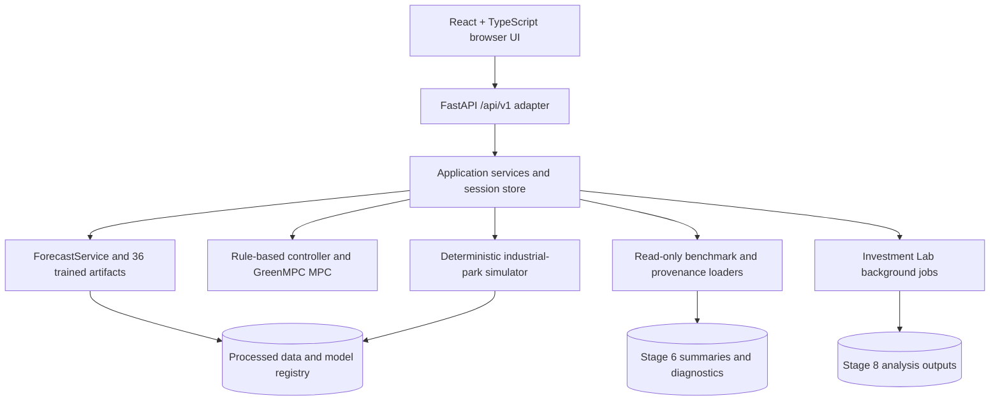

# GreenMPC Twin

**AI-Powered Energy Digital Twin for Eco-Industrial Parks**

GreenMPC Twin forecasts industrial energy demand and solar generation, then uses receding-horizon optimization to coordinate rooftop photovoltaic (PV) supply, battery energy storage system (BESS) dispatch, direct power purchase agreement (DPPA) renewable supply, grid import, and tenant-level renewable allocation.

The current prototype uses public, derived, and transparent scenario data; it does not claim access to confidential VRG operational data.

| Status | Evidence |
|---|---|
| Local offline demo | React + FastAPI command center served by `python scripts/run_command_center.py` |
| AI models | `2 tasks x 6 horizons x 3 quantiles = 36` trained forecasting artifacts in `models/forecasting/` |
| Optimization solver | Continuous linear model predictive control (MPC) using CVXPY + HIGHS, configured in `configs/mpc.yaml` |
| Closed-loop evaluation | Completed 72-hour Stage 6 manifest in `data/outputs/stage6_benchmark/benchmark_manifest.json` |
| Runtime packaging | `python scripts/verify_runtime_assets.py` and `python scripts/smoke_fresh_clone.py` |

## At a Glance

| Item | Summary |
|---|---|
| Problem | Industrial parks must coordinate variable tenant demand, rooftop solar, battery state, grid import, DPPA renewable supply, transformer capacity, and tenant renewable targets. |
| Solution | An offline digital twin that observes current state, forecasts six hours ahead, optimizes the next dispatch action, validates it, executes one simulated hour, and replans. |
| AI contribution | Probabilistic multi-horizon tenant-load forecasting, probabilistic park-level solar forecasting, and P10/P50/P90 uncertainty estimates. |
| Optimization contribution | Expected MPC and quantile-conservative deterministic MPC with hard energy-balance, BESS, DPPA, and transformer constraints. |
| Users | Industrial-park operators, facility energy managers, tenant sustainability teams, and infrastructure planners. |
| Demonstrated output | Live React/FastAPI command center, closed-loop benchmark summaries, terminal battery inventory fairness diagnostics, and Investment Lab scenario-analysis exports. |
| Reproducibility status | Runtime data, model artifacts, manifests, configs, and compact Stage 6 evidence are included for a fresh local clone. |

## Key Claims and Evidence

| Claim | Evidence |
|---|---|
| End-to-end AI-to-control loop is implemented. | `backend/`, `frontend/`, `src/greenmpc/forecasting/`, `src/greenmpc/control/`, `src/greenmpc/simulation/`, and [docs/WEB_COMMAND_CENTER.md](docs/WEB_COMMAND_CENTER.md). |
| Probabilistic forecasting uses 36 trained artifacts. | `models/forecasting/model_manifest.json` reports `model_count: 36`; artifacts are stored under `models/forecasting/load/` and `models/forecasting/solar/`. |
| Dispatch is constraint-aware, not a dashboard-only recommendation. | [docs/MPC_FORMULATION.md](docs/MPC_FORMULATION.md), [configs/mpc.yaml](configs/mpc.yaml), and `src/greenmpc/control/formulation.py`. |
| Closed-loop stress evaluation was completed. | `data/outputs/stage6_benchmark/benchmark_manifest.json` records 72 requested and 72 completed hours for four scenarios and three controllers. |
| Runtime is clone-checkable without historical verifiers. | `scripts/verify_runtime_assets.py` checks required files and fingerprints; `scripts/smoke_fresh_clone.py` executes one bounded forecast-plan-execute API cycle. |
| Data provenance and limitations are explicit. | `data/provenance/`, `data/processed/dataset_manifest.json`, [docs/PV_DERIVATION.md](docs/PV_DERIVATION.md), and [docs/INVESTMENT_LAB.md](docs/INVESTMENT_LAB.md). |

## Challenge Alignment

GreenMPC Twin interprets the challenge as an industrial-park energy-orchestration problem: uncertain tenant demand, variable renewable generation, shared transformer capacity, battery scheduling, DPPA allocation, renewable targets, and infrastructure-investment trade-offs must be managed together rather than in separate spreadsheets or static dashboards.

No official competition rubric or scoring weights were found in the repository. The table below is therefore an evidence index, not an official scoring rubric.

| Challenge need | GreenMPC capability | Evidence |
|---|---|---|
| Forecast uncertain demand | Six-hour P10/P50/P90 tenant-load forecasting | [configs/forecasting.yaml](configs/forecasting.yaml), `models/forecasting/model_manifest.json` |
| Forecast solar availability | Six-hour P10/P50/P90 park-level solar forecasting | [docs/FORECASTING.md](docs/FORECASTING.md), `data/outputs/forecast_metrics.csv` |
| Optimize multiple energy sources | MPC allocates PV, BESS, grid, and DPPA supply | [docs/MPC_FORMULATION.md](docs/MPC_FORMULATION.md), `src/greenmpc/control/` |
| Respect physical limits | SOC, battery power, transformer, DPPA, and energy-balance constraints | [docs/DIGITAL_TWIN.md](docs/DIGITAL_TWIN.md), [configs/mpc.yaml](configs/mpc.yaml) |
| Operate dynamically | Receding-horizon forecast-plan-execute cycle | [docs/WEB_COMMAND_CENTER.md](docs/WEB_COMMAND_CENTER.md), `backend/routers/control.py` |
| Evaluate stress conditions | Four closed-loop scenarios: normal, cloudy, production shift, combined stress | [configs/evaluation.yaml](configs/evaluation.yaml), `data/outputs/stage6_benchmark/benchmark_manifest.json` |
| Support infrastructure decisions | Investment Lab compares baseline and proposal configurations | [docs/INVESTMENT_LAB.md](docs/INVESTMENT_LAB.md), `src/greenmpc/investment/`, `backend/routers/investment.py` |
| Provide transparency | Tenant accounting, provenance, manifests, and evidence exports | `data/provenance/`, `data/processed/dataset_manifest.json`, `src/greenmpc/reporting/` |

## How It Works

GreenMPC Twin follows a receding-horizon loop:

1. Observe current park conditions.
2. Forecast the next six hours.
3. Optimize the next-hour energy dispatch.
4. Execute one validated simulated hour, measure the result, and replan.


The MPC optimizes a six-hour plan but executes only the first hour. At the next timestamp, the digital twin observes the new effective load, PV, DPPA, tariff, transformer, and battery state before generating a new forecast and plan.

## What Makes GreenMPC Twin Different

| Capability | Static dashboard | Rule-based EMS | Forecast-only tool | GreenMPC Twin |
|---|---:|---:|---:|---:|
| Current-state visibility | Yes | Sometimes | Sometimes | Yes |
| Probabilistic forecast | No | No | Yes | Yes |
| Closed-loop optimization | No | No | No | Yes |
| Physical action validation | No | Usually limited | No | Yes |
| PV, BESS, grid, and DPPA coordination | No | Limited | No | Yes |
| Tenant-level renewable allocation | No | Limited | No | Yes |
| Stress-scenario evaluation | No | Limited | No | Yes |
| Visible fallback on infeasibility | No | No | No | Yes |
| Reproducible local evidence | Limited | Limited | Limited | Yes |

The innovation is the integration: GreenMPC Twin is not only a forecast display and not only an optimizer. It connects learned uncertainty estimates, physical constraints, validated simulator execution, controller comparison, and user-facing evidence in one offline product.

## AI and Optimization Core

The forecasting registry contains 36 lightweight scikit-learn model artifacts:

```text
2 forecasting tasks x 6 forecast horizons x 3 quantiles = 36 models
```

The two tasks are tenant load and park solar availability. Load models are global multi-tenant models; solar models are park-level models. P10, P50, and P90 are forecast quantiles, not a 95% confidence interval.

Expected MPC uses P50 load and P50 solar. Risk-aware GreenMPC uses P90 load and P10 solar as a quantile-conservative deterministic input, not as a formal stochastic or distributionally robust optimizer.

The control objective separates operating-cost proxy terms from control penalties:

- grid energy cost;
- DPPA energy cost;
- BESS throughput degradation proxy;
- grid peak penalty;
- PV curtailment penalty;
- renewable shortfall penalty;
- terminal reserve shortfall penalty.

The optimization respects hard power-balance, PV-balance, BESS, DPPA availability, and transformer constraints. It does not create grid export, unmet load, grid-to-battery charging, integer variables, or binary unit-commitment decisions.

Detailed formulation: [docs/MPC_FORMULATION.md](docs/MPC_FORMULATION.md). API usage: [docs/MPC_API.md](docs/MPC_API.md).

## System Architecture



| Layer | Technology | Responsibility | Paths |
|---|---|---|---|
| Frontend | React, TypeScript, Vite | Live Demo, Investment Lab, Results and Evidence pages | `frontend/` |
| API adapter | FastAPI, Pydantic | Session, forecast, plan, execute, benchmark, provenance, investment endpoints | `backend/` |
| Forecasting | scikit-learn, joblib | Multi-horizon P10/P50/P90 load and solar forecasts | `src/greenmpc/forecasting/`, `models/forecasting/` |
| Control | CVXPY, HIGHS | Continuous six-hour MPC and fallback handling | `src/greenmpc/control/` |
| Simulation | pandas, dataclasses | Hourly digital-twin state transition and accounting | `src/greenmpc/simulation/` |
| Evaluation | Python services | Closed-loop controller comparison and KPI summaries | `src/greenmpc/evaluation/`, `data/outputs/stage6_benchmark/` |
| Investment | Python services | Baseline/proposal cloned analyses and evidence packages | `src/greenmpc/investment/`, `backend/routers/investment.py` |
| Provenance | JSON/YAML manifests | Source classification, fingerprints, assumptions | `data/provenance/`, `data/processed/dataset_manifest.json` |

Heavy immutable resources are loaded once per backend process. Mutable simulator state is isolated per in-memory session and guarded by a per-session lock.

## Data, Assumptions, and Provenance

| Item | Classification | Current evidence |
|---|---|---|
| Tenant load shapes | Public measured data, rescaled into scenario tenants | UCI source metadata in `data/provenance/sources.yaml`; selected tenants in `data/processed/selected_tenant_profiles.csv` |
| Weather and solar resource | Satellite/model-based public weather data | NASA POWER metadata in `data/provenance/sources.yaml` |
| PV output | Derived data | `data/processed/dataset_manifest.json`, [docs/PV_DERIVATION.md](docs/PV_DERIVATION.md) |
| Tariff | Configured operational assumption | [configs/demo.yaml](configs/demo.yaml) |
| DPPA volume and price | Contract scenario assumption | [configs/demo.yaml](configs/demo.yaml) |
| Tenant labels and industries | Scenario constructs | [configs/demo.yaml](configs/demo.yaml), `data/processed/dataset_manifest.json` |
| Stress events | Synthetic scenario events | [configs/evaluation.yaml](configs/evaluation.yaml) |
| Runtime fingerprints | Reproducibility metadata | `data/processed/dataset_manifest.json`, `models/forecasting/model_manifest.json` |

The processed dataset spans `2013-01-02 00:00:00+07:00` through `2013-12-31 23:00:00+07:00`, with 8,736 hourly timestamps and 364 complete local days.

PV is derived from NASA POWER `ALLSKY_SFC_SW_DWN` with input unit `Wh/m^2`. The current formula version is `simple_capacity_factor_v2`:

```text
normalized_solar_input = (ALLSKY_SFC_SW_DWN_Wh_m2 / 1000) / 1.0 kWh/m^2
pv_available_kw = installed_capacity_kw x normalized_solar_input x performance_ratio
```

The configured PV capacity is 2,500 kW and the performance ratio is 0.86. The processed PV quality report records 4,174 unique positive raw-resource values, 4,174 unique positive derived-PV values, zero clipped outputs, and a processed-period PV capacity factor of 18.57%.

GreenMPC Twin does not claim measured rooftop PV, actual confidential tenant data, actual confidential DPPA terms, or physical SCADA integration.

## Verified Results

The completed Stage 6 evaluation used:

- 72 requested and 72 completed hours;
- start timestamp `2013-11-01T17:00:00+07:00`;
- end timestamp `2013-11-04T16:00:00+07:00`;
- four scenarios: normal, cloudy, production shift, combined stress;
- three controllers: rule-based, deterministic MPC, and quantile-conservative GreenMPC;
- 12 scenario-controller runs;
- zero invalid actions and zero hard-constraint violations in `controller_scenario_metrics.csv`.

Evidence files:

- `data/outputs/stage6_benchmark/benchmark_manifest.json`
- `data/outputs/stage6_benchmark/controller_scenario_metrics.csv`
- `data/outputs/stage6_benchmark/forecast_diagnostics.csv`
- `data/outputs/stage6_audit/terminal_inventory_adjusted_costs.csv`


Caption: The chart is generated from `data/outputs/stage6_benchmark/controller_scenario_metrics.csv` by `scripts/generate_readme_assets.py`. It shows realized operating-cost proxy and peak grid import by controller and scenario.

### Controller Comparison

All cost values are realized operating-cost proxy values from executed simulator history, not planned MPC objective values.

| Scenario | Controller | Completed steps | Cost (M VND) | Renewable share | Peak grid (kW) | Peak external (kW) | Final SOC | Shortfall (kWh) | Fallbacks |
|---|---|---:|---:|---:|---:|---:|---:|---:|---:|
| Normal | Rule-based | 72 | 423.56 | 53.18% | 3,217.4 | 4,717.4 | 10.0% | 2,829.5 | 0 |
| Normal | Deterministic MPC | 72 | 433.83 | 52.61% | 2,610.2 | 4,110.2 | 42.2% | 0.0 | 0 |
| Normal | Conservative GreenMPC | 72 | 426.55 | 49.94% | 3,697.2 | 5,197.2 | 90.0% | 1,535.6 | 9 |
| Solar Drop | Rule-based | 72 | 437.07 | 51.36% | 3,217.4 | 4,717.4 | 10.0% | 3,441.3 | 0 |
| Solar Drop | Deterministic MPC | 72 | 445.28 | 50.82% | 2,610.5 | 4,110.5 | 42.2% | 331.2 | 0 |
| Solar Drop | Conservative GreenMPC | 72 | 443.88 | 50.23% | 3,697.2 | 5,197.2 | 90.0% | 0.0 | 9 |
| Production Surge | Rule-based | 72 | 423.87 | 53.14% | 3,217.4 | 4,717.4 | 10.0% | 4,462.0 | 0 |
| Production Surge | Deterministic MPC | 72 | 434.16 | 52.57% | 2,610.2 | 4,110.2 | 42.2% | 0.0 | 0 |
| Production Surge | Conservative GreenMPC | 72 | 426.90 | 49.93% | 3,697.2 | 5,197.2 | 90.0% | 1,535.6 | 9 |
| Combined Stress | Rule-based | 72 | 460.10 | 47.74% | 3,698.7 | 4,717.4 | 10.0% | 11,721.8 | 0 |
| Combined Stress | Deterministic MPC | 72 | 467.25 | 47.25% | 3,698.7 | 4,598.7 | 42.0% | 744.2 | 0 |
| Combined Stress | Conservative GreenMPC | 72 | 467.40 | 46.90% | 3,698.7 | 5,197.2 | 90.0% | 5,025.0 | 24 |

Evidence-supported interpretation:

- In Normal Operations, deterministic MPC reduced peak grid import from 3,217.4 kW to 2,610.2 kW relative to rule-based control, an 18.87% reduction, while ending with a higher battery state of charge.
- Rule-based control often reports the lowest raw operating-cost proxy but ends at 10.0% SOC in every scenario, which motivates the terminal battery inventory diagnostic below.
- Conservative GreenMPC preserved battery inventory but used fallback actions when the P90-load/P10-solar deterministic planning case became physically infeasible.
- No controller is universally best across cost, renewable share, battery inventory, fallback count, and peak import.

### Forecast Quality During Closed-Loop Evaluation

Forecast diagnostics compare forecast origin `t` to realized event-adjusted targets at `t+h` for horizons 1 through 6. P10-P90 coverage is empirical interval coverage, not a confidence interval.


Caption: The chart is generated from `data/outputs/stage6_benchmark/forecast_diagnostics.csv` by `scripts/generate_readme_assets.py`. It reports WAPE and P10-P90 coverage by scenario, event status, and task.

| Scenario and event status | Task | Samples | MAE (kW) | WAPE | Bias (kW) | P10-P90 coverage |
|---|---|---:|---:|---:|---:|---:|
| Normal, non-event | Load | 2,055 | 77.99 | 10.11% | -38.24 | 93.8% |
| Normal, non-event | Solar | 411 | 94.32 | 16.48% | -59.79 | 83.5% |
| Solar Drop, non-event | Load | 1,875 | 77.33 | 10.04% | -35.58 | 94.2% |
| Solar Drop, event | Solar | 36 | 473.92 | 68.59% | 473.92 | 100.0% |
| Production Surge, event | Load | 150 | 75.03 | 11.30% | -54.17 | 99.3% |
| Combined Stress, event | Load | 240 | 198.68 | 20.62% | -190.51 | 49.6% |
| Combined Stress, event | Solar | 48 | 537.96 | 88.40% | 537.96 | 100.0% |

These numbers show why closed-loop replanning matters: unannounced stress events change realized load and PV after the original forecast is made.

### Stage 4 Forecast Test Metrics

From `data/outputs/forecast_metrics.csv`, the stored Stage 4 test split reports:

| Task | Aggregate test WAPE |
|---|---:|
| Tenant load | 11.48% |
| Park solar | 14.80% |

These are model evaluation metrics on the processed public/scenario dataset, not actual VRG forecast accuracy.

### Fair Cost Comparison

Raw operating cost alone may reward a controller that ends with a depleted battery. GreenMPC Twin therefore adds a terminal battery inventory diagnostic without overwriting the raw metric:

```text
inventory-adjusted cost
= raw operating cost
+ (initial battery energy - final battery energy) x valuation price
```

The default stored valuation price is 1,100 VND/kWh, aligned with the configured off-peak replenishment price. Sensitivity values are stored for 1,500, 2,000, and 2,500 VND/kWh.

| Scenario | Controller | Raw cost (M VND) | Terminal adjustment (M VND) | Adjusted cost at 1,100 VND/kWh (M VND) | Rank |
|---|---|---:|---:|---:|---:|
| Normal | Rule-based | 423.56 | 1.32 | 424.88 | 1 |
| Normal | Conservative GreenMPC | 426.55 | -1.32 | 425.23 | 2 |
| Normal | Deterministic MPC | 433.83 | 0.26 | 434.09 | 3 |
| Combined Stress | Rule-based | 460.10 | 1.32 | 461.42 | 1 |
| Combined Stress | Conservative GreenMPC | 467.40 | -1.32 | 466.08 | 2 |
| Combined Stress | Deterministic MPC | 467.25 | 0.26 | 467.51 | 3 |

At higher Normal Operations valuation prices, `data/outputs/stage6_audit/terminal_inventory_sensitivity.csv` shows the rank changes: Conservative GreenMPC ranks first at 1,500, 2,000, and 2,500 VND/kWh. This diagnostic is not a full battery degradation model.

### Runtime Evidence

The Stage 6 full benchmark manifest records 543.02 seconds total runtime for the 12-run, 72-hour evaluation. Runtime components by scenario and controller are stored in `data/outputs/stage6_benchmark/runtime_metrics.csv`. Product launch does not require rerunning this benchmark.

## Live Product Experience

The primary interface is the React/FastAPI command center.

User workflow:

1. Start the live simulation.
2. Observe load, solar, battery, DPPA, grid, and transformer state.
3. View the six-hour forecast.
4. View the GreenMPC next-hour recommendation.
5. Execute one validated simulated hour.
6. Watch KPIs, energy topology, and rolling history update.
7. Trigger a stress scenario.
8. Observe reforecasting and replanning.

Modes:

| User-facing mode | Technical behavior |
|---|---|
| Operator Approval | Forecast, plan, validate, then wait for explicit execution approval. |
| Live Autonomous Demo | A bounded frontend timer calls one control cycle per simulated hour. |
| Recommendation Only | Forecasts and plans repeatedly but does not execute simulator actions. |

The Streamlit application remains available as a technical fallback, but the React/FastAPI product is the primary competition interface.

## Investment Scenario Lab

The Investment Lab is an offline scenario-analysis page and API. It compares the approved baseline infrastructure with one proposal using cloned simulator/controller runs.

Implemented analysis questions:

- How does changing PV capacity affect grid import, curtailment, renewable share, and cost?
- How do BESS energy capacity and power rating affect peak demand and battery cycling?
- How do DPPA volume and price affect operating cost and tenant renewable allocation?
- Does the proposal reduce renewable shortfall?
- How does each tenant's realized energy mix change?
- What are the estimated CAPEX, annualized operating savings, and simple payback under editable assumptions?
- Can the user export tenant-level renewable allocation evidence?

PV capacity uses a documented approximation:

```text
candidate_pv_kw = baseline_pv_kw x candidate_capacity_kw / baseline_capacity_kw
```

This is a capacity-scaling approximation using the same weather-resource profile. It is not a site-layout, shading, supplier quote, financial recommendation, official certificate, or legal DPPA settlement tool.

Detailed method: [docs/INVESTMENT_LAB.md](docs/INVESTMENT_LAB.md).

## Reproducibility

Supported runtime environment:

| Dependency | Requirement |
|---|---|
| Python | `>=3.11,<3.13` from [pyproject.toml](pyproject.toml) |
| Node.js | Current LTS recommended for Vite/React build |
| Solver | `highspy` provides HIGHS for CVXPY |
| Git LFS | Not required for current runtime assets |
| Network | Not required after repository clone and dependency installation |
| Storage note | Largest required runtime file is `data/processed/tenant_hourly.csv`, about 25 MiB |

### Path A: Run the Product

```bash
git clone https://github.com/anthe8105/GreenMPC_VAIC.git
cd GreenMPC_VAIC

python3 -m venv .venv
source .venv/bin/activate

python -m pip install --upgrade pip
python -m pip install -e . --no-build-isolation

python scripts/verify_runtime_assets.py

cd frontend
npm install
npm run build
cd ..

python scripts/run_command_center.py
```

Open:

```text
http://127.0.0.1:8000
```

Windows PowerShell activation:

```powershell
.\.venv\Scripts\activate
```

Streamlit fallback:

```bash
python -m streamlit run streamlit_app.py
```

### Path B: Verify One Bounded Control Cycle

```bash
python scripts/smoke_fresh_clone.py
```

This bounded smoke check initializes the FastAPI application in-process, creates one session, generates one six-hour forecast, creates one deterministic MPC plan, validates one action, executes exactly one simulated hour, confirms one-hour timestamp advancement, and loads benchmark/provenance views.

### Optional Full Benchmark Reproduction

The product does not require rerunning Stage 6. To reproduce the stored full benchmark intentionally:

```bash
python scripts/run_closed_loop_benchmark.py --force --profile
```

The stored full-run manifest records 543.02 seconds for the prior 12-run, 72-hour benchmark on the development machine. Runtime depends on hardware and Python environment.

## Repository Structure

| Path | Role |
|---|---|
| `backend/` | FastAPI adapter, route definitions, session store, and investment background-job wrapper. |
| `frontend/` | React + TypeScript command center, live demo, investment lab, and evidence pages. |
| `src/greenmpc/data/` | Public-data acquisition, preprocessing, PV derivation, profile selection, and validation. |
| `src/greenmpc/forecasting/` | Feature engineering, model registry, quantile forecasts, metrics, and training utilities. |
| `src/greenmpc/simulation/` | Deterministic industrial-park simulator, state, action validation, and accounting. |
| `src/greenmpc/control/` | MPC config, input builder, formulation, solver, postprocessing, diagnostics, and fallback. |
| `src/greenmpc/evaluation/` | Closed-loop runner, scenarios, rule-based baseline, history adapter, and realized metrics. |
| `src/greenmpc/investment/` | Baseline/proposal scenario-analysis service and investment configuration. |
| `configs/` | Demo, dataset, forecasting, MPC, evaluation, and investment assumptions. |
| `data/processed/` | Versioned processed runtime data and dataset manifests. |
| `data/outputs/` | Compact Stage 4/6 summaries and diagnostics used by the UI. |
| `models/forecasting/` | Versioned trained model artifacts and model manifest. |
| `docs/` | Architecture, data, forecasting, MPC, evaluation, control room, web UI, and Investment Lab documentation. |
| `scripts/` | Launch, verification, benchmark, smoke, and asset-generation commands. |
| `tests/` | Focused unit and integration tests. |

## API Overview

| Route | Method | Purpose |
|---|---|---|
| `/api/v1/health` | GET | Check API availability. |
| `/api/v1/sessions` | POST | Create a simulator session. |
| `/api/v1/sessions/{session_id}/reset` | POST | Reset timestamp, scenario, controller, history, and pending plan. |
| `/api/v1/sessions/{session_id}/state` | GET | Read current digital-twin state and KPIs. |
| `/api/v1/sessions/{session_id}/forecast` | POST | Generate one shared six-hour forecast bundle. |
| `/api/v1/sessions/{session_id}/plan` | POST | Create a controller plan and validated first action without execution. |
| `/api/v1/sessions/{session_id}/execute` | POST | Execute exactly one current validated action. |
| `/api/v1/sessions/{session_id}/control-cycle` | POST | Forecast, plan, validate, and optionally execute one hour depending on mode. |
| `/api/v1/benchmark` | GET | Load read-only Stage 6 summaries and terminal inventory diagnostics. |
| `/api/v1/provenance` | GET | Load data/model/provenance disclosures. |
| `/api/v1/investment/defaults` | GET | Load baseline investment assumptions. |
| `/api/v1/investment/analyses` | GET/POST | List or start bounded Investment Lab analyses. |
| `/api/v1/investment/analyses/{analysis_id}` | GET | Poll analysis status. |
| `/api/v1/investment/analyses/{analysis_id}/result` | GET | Return completed analysis results. |
| `/api/v1/investment/analyses/{analysis_id}/cancel` | POST | Cancel between safe simulation steps. |
| `/api/v1/investment/analyses/{analysis_id}/export` | GET | Download the evidence ZIP for a completed analysis. |

State-changing requests use `request_id`, `run_id`, and `expected_timestamp`. The backend uses a per-session lock, rejects stale timestamps, prevents duplicate execution, preserves state on failure, and labels fallback actions explicitly.

## Verification and Software Quality

| Check | Command | Verified outcome or artifact |
|---|---|---|
| Runtime asset package | `python scripts/verify_runtime_assets.py` | Checks processed data, 36 model artifacts, dataset/model fingerprints, Stage 6 compact evidence, FastAPI import, and repository-relative runtime paths. |
| One bounded control cycle | `python scripts/smoke_fresh_clone.py` | Checks one forecast, one deterministic MPC plan, one validated action, exactly one-hour advancement, benchmark loading, and provenance loading. |
| Frontend build | `cd frontend && npm run build` | Builds the React/Vite production bundle locally. |
| Stage 6 completed run | `data/outputs/stage6_benchmark/benchmark_manifest.json` | Records 72 completed hours for all four scenarios and three controllers. |
| KPI reconciliation source | `data/outputs/stage6_benchmark/controller_scenario_metrics.csv` | Stores realized controller KPIs with completed hours, invalid actions, hard violations, and fallback counts. |
| Forecast diagnostic source | `data/outputs/stage6_benchmark/forecast_diagnostics.csv` | Stores realized target timestamps, actual values, P10/P50/P90, WAPE inputs, bias, interval width, and coverage. |
| README result figures | `python scripts/generate_readme_assets.py` | Rebuilds deterministic SVG figures from stored Stage 6 CSVs only. |

Full historical stage verifiers and long benchmarks are available in `scripts/`, but they are not required for normal product launch.

## Scope and Limitations

GreenMPC Twin is a scenario-based decision-support prototype. It is not connected to physical SCADA, a building-management system, a battery-management system, or utility settlement systems.

The dataset uses public measured profiles, derived PV, and scenario assumptions. It does not use confidential VRG operational data, actual VRG tenant data, actual confidential DPPA contracts, actual VRG battery specifications, or actual VRG transformer topology.

Financial calculations in the Investment Lab are editable demonstration assumptions. They are not supplier quotations, investment advice, or legal settlement evidence.

Tenant renewable evidence is generated from simulated source-level accounting. It is not an official renewable certificate.

The forecasting horizon is six hours. Conservative MPC may fall back when hard physical constraints become infeasible under P90-load/P10-solar inputs. Results depend on the selected scenario, controller, initial battery inventory, event policy, tariff assumptions, DPPA assumptions, and terminal battery valuation.

In-memory web sessions are suitable for a local competition demo. Production deployment would require authentication, persistence, observability, security hardening, and real telemetry interfaces.

## Practical Impact

Demonstrated value:

- operational visibility into park load, renewable supply, battery state, transformer utilization, and tenant allocation;
- receding-horizon energy dispatch with physical validation;
- transparent comparison of conventional rule-based control, expected MPC, and risk-aware GreenMPC;
- stress testing under unannounced solar, load, and DPPA events;
- tenant-level renewable allocation evidence;
- infrastructure scenario analysis for PV, BESS, and DPPA decisions.

Potential users include industrial-park operators, energy managers, tenant sustainability teams, and infrastructure planners. Deployment to a real site would require real metering, site-specific models, operational approvals, and production security controls.

## Evaluation Evidence Map

Because no official competition rubric was found in the repository, this table maps common evaluation dimensions to repository evidence.

| Evaluation dimension | Evidence in this project | Result or artifact | Reproduction path |
|---|---|---|---|
| Problem relevance | Industrial-park load, PV, BESS, DPPA, transformer, and tenant targets modeled together | [configs/demo.yaml](configs/demo.yaml), [docs/PROJECT_SCOPE.md](docs/PROJECT_SCOPE.md) | Read configs and launch the demo. |
| AI methodology | 36 quantile forecasting models for load and solar | `models/forecasting/model_manifest.json` | `python scripts/verify_runtime_assets.py` |
| Optimization quality | Continuous linear MPC with physical constraints and fallback handling | [docs/MPC_FORMULATION.md](docs/MPC_FORMULATION.md), [configs/mpc.yaml](configs/mpc.yaml) | `python scripts/run_mpc_example.py` if deeper inspection is needed. |
| Evaluation quality | 72-hour closed-loop evaluation across four scenarios and three controllers | `data/outputs/stage6_benchmark/benchmark_manifest.json` | Optional: `python scripts/run_closed_loop_benchmark.py --force --profile` |
| User experience | React/FastAPI Live Demo, Investment Lab, and Results and Evidence pages | `frontend/src/App.tsx`, [docs/WEB_COMMAND_CENTER.md](docs/WEB_COMMAND_CENTER.md) | `python scripts/run_command_center.py` |
| Feasibility | Offline runtime assets and local smoke test | `scripts/verify_runtime_assets.py`, `scripts/smoke_fresh_clone.py` | Run both commands after installing dependencies. |
| Impact | Peak, renewable, shortfall, fallback, and cost trade-offs reported by scenario | `data/outputs/stage6_benchmark/controller_scenario_metrics.csv` | Inspect stored CSV or README tables. |
| Transparency | Source classification, PV formula, assumptions, and limitations are documented | `data/provenance/`, [docs/PV_DERIVATION.md](docs/PV_DERIVATION.md) | Read provenance and dataset manifest. |

## Roadmap

- Integrate site-approved metering, SCADA, BMS, and DPPA data connectors.
- Calibrate load and solar models on site-specific history.
- Add persistent multi-user sessions, authentication, and audit logging.
- Replace simplified battery economics with detailed degradation and warranty modeling.
- Add legal/certificate settlement integrations only with approved data and governance.
- Harden production deployment, monitoring, security, and failure-response procedures.

## Team

| Name | Role | Verified contribution |
|---|---|---|
| GreenMPC Twin Team | Project team | Repository author entry in [pyproject.toml](pyproject.toml); integrated data, forecasting, simulation, control, evaluation, UI, and investment-analysis prototype. |
| TODO: confirm individual contributor names | TODO | Individual ownership is not specified in the repository. |

## References and Data Sources

Primary source metadata is stored in `data/provenance/sources.yaml`:

- UCI Machine Learning Repository, Electricity Load Diagrams 2011-2014.
- UCI Machine Learning Repository, Steel Industry Energy Consumption.
- NASA POWER Hourly Weather and Solar Resource.
- Vietnam tariff reference metadata from government/EVN sources documented in provenance.

Raw files are excluded from Git. Processed runtime files and source fingerprints are versioned where needed for the local demo.

## License

No open-source license file is present in the repository. Until a license is added, reuse rights are not explicitly granted beyond private review by the project team and competition evaluators.
