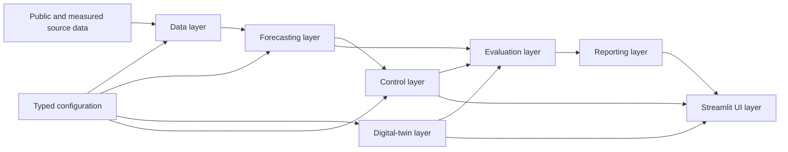

# Architecture

GreenMPC Twin uses a layered Python architecture with explicit module boundaries. The Stage 0 repository freezes these boundaries without implementing future-stage behavior.

## High-Level Layers

- Data layer: source acquisition, local raw-data caching, preprocessing, timestamp alignment, resampling, profile selection, scaling, provenance, and validation.
- Forecasting layer: feature construction, chronological splitting, model training, quantile forecasts, inference, and forecast metrics.
- Digital-twin layer: park state, physical energy transitions, battery state, cost accounting, renewable-energy allocation, event effects, and action validation.
- Control layer: continuous linear MPC formulation, solver execution, post-solve validation, and clearly labeled fallback behavior.
- Evaluation layer: closed-loop backtesting, controller comparison, KPI calculation, and scenario evaluation.
- Reporting layer: renewable-energy ledger, tenant summaries, CSV export, and audit-ready HTML evidence reports.
- UI layer: Streamlit session state, charts, user controls, event injection, recommendation displays, and investment scenario interaction.

## Dependency Direction

Dependencies flow from user-facing layers toward core services and data structures:

UI -> Reporting, Evaluation, Control, Forecasting, Simulation
Evaluation -> Control, Forecasting, Simulation, Reporting
Control -> Forecasting outputs and validated simulator interfaces
Simulation -> Configured state, actions, and event definitions
Forecasting -> Data-layer prepared datasets
Reporting -> Validated simulation records

Lower layers must not import Streamlit. Algorithms must receive configuration values explicitly through typed configuration objects rather than silently hard-coding business assumptions.

## Controller and Simulator Separation

- The simulator never chooses actions.
- The controller never mutates simulator state directly.
- Controller outputs must be validated before state transition.
- Investment scenarios must operate on cloned state and must not modify the live simulator.
- Reporting consumes validated simulation records rather than controller internals.
- Stage 3 implements the simulator action contract and strict validation only. The reference feasible-action helper exists for simulator verification and is not an operational controller.
- Stage 4 implements forecasting pipelines that consume validated processed history and emit forecast bundles. Forecasting does not import simulator internals, CVXPY, Streamlit, MPC code, or production controllers.
- Stage 5 implements a controller that consumes forecast bundles and simulator observations, solves a continuous LP with HIGHS, extracts a first `ParkAction`, and validates it through the simulator without mutating simulator state. Closed-loop evaluation remains out of scope for the control layer.
- Stage 6 owns closed-loop orchestration. It clones simulator state per controller, shares forecast bundles fairly, executes one action per hour, and computes realized KPIs from simulator histories.
- Stage 7 owns the Streamlit Live Control Room. It caches heavy offline resources, stores mutable demo state in session state, triggers forecast/plan/execute only through explicit buttons, and reads Stage 6 benchmark outputs without rerunning them.

## Mermaid Diagram

## Future Real-SCADA Integration Point

If actual operational telemetry is approved in a later deployment, it must enter only through the data layer as a provenance-tagged source connector. The connector must produce the same validated, timestamp-aligned data contract used by cached public demo data so forecasting, simulation, control, reporting, and UI modules do not change their boundaries.
